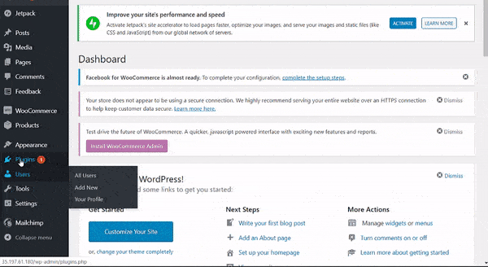

# woocommerce-order-popup

---

Sometimes when there are a lot of orders on of woocommerce store. Often the new orders are missed from your eyes. Keeping track of new orders is as important as fulfilling old orders.

So `woocommerce-order-popup` is a woocommerce plugin that tries to help you in resolving this problem. This plugin will show a popup with a strong notification sound on your wordpress admin dashboard, whenever there's a new order. So that you can take immediate action on that order. 

---

## Installing

**You can download repository as a zip file and then extract all the content the repository in `wp-content/plugins` folder and then enabling the plugin inside your `wp-admin` dashboard.**

**Or you can directly clone the repository by following steps**

- Inside your `wordpress` root folder, run this command

  ```bash
  cd ./wp-content/plugins
  ```

- Then clone the repository

  ```bash
  sudo git clone https://github.com/Reepulse/woocommerce-order-popup.git
  ```

- Then login to your `wp-admin` dashboard

- Then go to `installed plugins` and activate the `woocommerce-order-popup` plugin


> Downloading the plugin

---

## Usage

Usage of the plugin is as simple as you can think

- After activating the plugin, the plugin will automagically start working for new orders
- You can customize the plugin by going into plugin settings under the `Woocommerce Order Popup` section
- In the homepage of `woocommerce-order-plugin` you will see all the orders.



> Usage of the plugin

---


